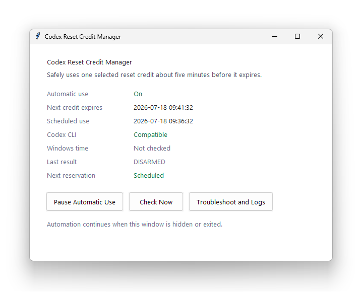

# Codex 사용 한도 초기화 관리자

Codex Usage Limit Reset Manager는 작고 단순한 커뮤니티 제작 Windows용 Codex reset scheduler입니다. OpenAI Codex에서 선택한 사용 한도 초기화 한 건을 만료 약 5분 전에 자동으로 사용합니다. 몇 개의 Python 및 PowerShell 스크립트와 작은 Tkinter UI, Windows 작업 스케줄러, 로컬 Codex CLI app-server를 결합한 토이 프로젝트입니다.

ChatGPT 화면에는 이 기능이 **Usage limit resets**로 표시됩니다. 과거 게시물에서는 **Codex reset credits**라고 부르기도 하며, 로컬 Codex app-server는 내부적으로 rate-limit reset credit 용어를 사용합니다.

**Codex auto redeem reset**, **Codex auto reset reserve** 같은 검색 문구는 이 프로젝트에서 기존 사용 한도 초기화 항목의 사용을 예약하고 실행한다는 뜻일 뿐이며, 추가 초기화를 만들거나 플랜의 사용 한도를 늘리지 않고 `auth.json`을 읽거나 backend API를 직접 호출하지 않습니다.

영문 문서는 [README.md](README.md)에 있습니다.



*실제 Codex Usage Limit Reset Manager 화면입니다.*

## 빠른 시작

요구 사항:

- PowerShell 7(`pwsh.exe`)을 사용할 수 있는 Windows
- 같은 설치 폴더에 `python.exe`와 `pythonw.exe`가 있는 CPython 3.13
- 전역 npm으로 설치한 Codex CLI `0.144.1` 이상
- Codex CLI에 로그인된 계정

1. `setup.cmd`를 더블클릭합니다.
2. 관리창에서 **Start Automatic Use**를 선택합니다.
3. **Automatic use: On**과 사용 예정 시각을 확인합니다.

새 설치는 일시정지 상태로 시작합니다. Windows 시간을 `time.windows.com`과 동기화해야 할 때만 UAC 권한을 요청하며, 시계가 정상이면 나타나지 않습니다.

## 작동 방식

`ManagerSync`는 로그인할 때와 30분마다 실행됩니다. 계정, 시계, Codex CLI, 전체 사용 한도 초기화 목록을 확인하고 예약을 최대 하나로 유지하지만, 해당 초기화를 직접 사용하지는 않습니다.

exact-ID one-shot 작업 하나가 조금 일찍 시작해 만료 약 T−5분에 사용을 처리합니다. 선택한 항목만 사용하며 다른 항목으로 대체하지 않습니다. 동기화가 30분마다 실행되므로 새 사용 한도 초기화는 만료까지 약 **46분** 이상 남아 있을 때만 자동 발견을 보장합니다. Controller가 만료에 너무 가까운 시점에 발견하면 서두른 live 작업을 만들지 않습니다.

전역 Codex CLI가 변경되면 `ManagerSync`가 버전, 서명, 필요한 app-server 계약, 계정, 전체 사용 한도 초기화 목록을 읽기 전용으로 자동 재검증합니다. 검증된 CLI 업데이트만 후속 예약에 승인합니다.

## 알아둘 점

- **X**는 관리창을 알림 영역으로 숨깁니다. **Exit UI**는 창과 tray 아이콘만 종료합니다. 둘 다 자동 사용을 일시정지하지 않으며 시작 메뉴 바로가기로 다시 열 수 있습니다.
- **Pause Automatic Use** 또는 `pause` 명령은 자동운영을 멈추고 활성 예약에 취소 표시를 남기며 다음 예약을 막습니다.
- 작업은 현재 사용자가 로그인한 동안에만 실행됩니다. `ManagerSync`는 PC를 깨우지 않으며 exact one-shot 작업만 `WakeToRun`으로 로그인 세션의 잠든 PC를 깨울 수 있습니다.
- 같은 Codex 계정의 자동 사용을 여러 PC에서 동시에 켜지 마십시오. 각 설치가 같은 사용 한도 초기화를 두고 경쟁할 수 있습니다.

## 안전 원칙

- 계정 조회와 사용 한도 초기화 항목의 사용은 Codex CLI가 제공하는 로컬 app-server만 이용합니다.
- Policy, 로그, UI, 알림은 원본 내부 credit ID, 이메일 주소, token, 멱등 키를 저장하거나 표시하지 않습니다.
- 불완전하거나 모호한 정보, 계정 변경, 시계 문제, 비호환 CLI, 변경된 계약은 fail-closed 처리합니다.
- 각 사용 한도 초기화는 미리 선택한 exact internal ID에 고정됩니다. 불명 결과는 해당 항목이 만료되어 목록에서 사라질 때까지 장벽으로 남으며, controller가 추측하거나 더 늦은 항목으로 넘어가지 않습니다.

<details>
<summary>Advanced / development</summary>

PowerShell에서 설치를 미리 확인하거나 실행합니다.

```powershell
# 변경하지 않는 사전 확인
pwsh -NoProfile -File .\install.ps1 -WhatIf -Confirm:$false

# 설치 또는 업데이트
pwsh -NoProfile -File .\install.ps1 -Confirm:$false

# 필요한 경우 UAC를 이용한 시간 복구 허용
pwsh -NoProfile -File .\install.ps1 -ConfigureWindowsTime -Confirm:$false
```

Manager 명령:

```powershell
python .\codex_reset_manager.py ui
python .\codex_reset_manager.py enable
python .\codex_reset_manager.py pause
python .\codex_reset_manager.py sync --scheduled
python .\codex_reset_manager.py status --json
python .\codex_reset_manager.py doctor
```

실제 consume 없는 fake app-server 테스트를 실행합니다.

```powershell
python -W error::ResourceWarning -m unittest discover -s tests -v
```

</details>
