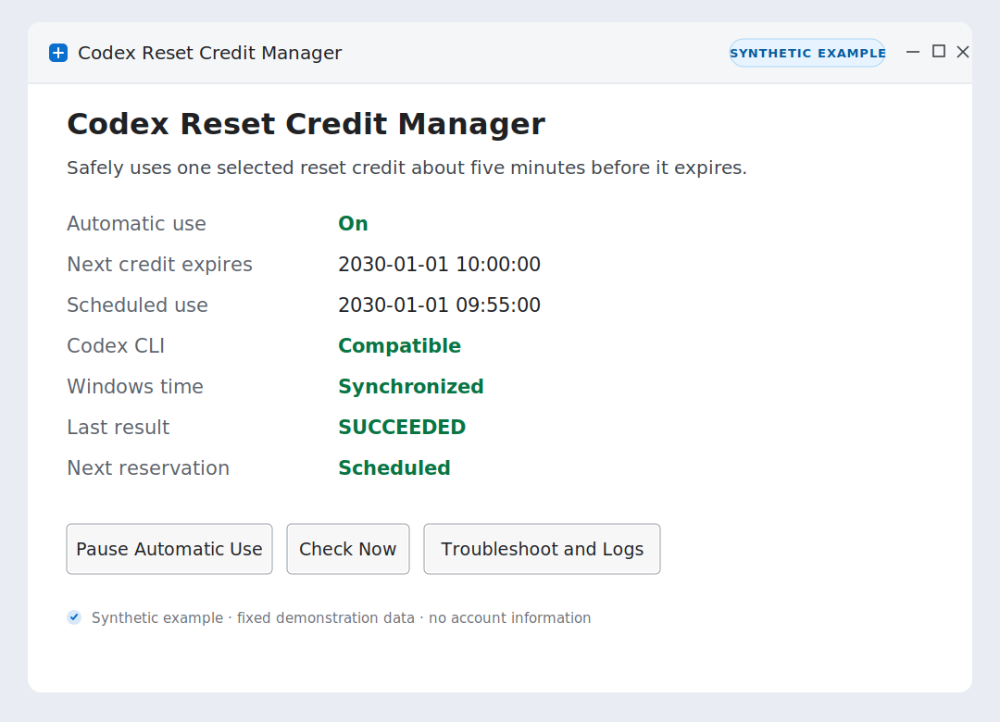

# Codex Reset Credit Manager

Codex Reset Credit Manager is a community-built Windows automation tool that automatically redeems (consumes) one selected OpenAI Codex reset credit about five minutes before it expires. It combines Python and PowerShell scripts, Windows Task Scheduler, and the local Codex CLI app-server with fail-closed exact-credit checks. After installation, open the small manager window from the Start Menu and select **Start Automatic Use** once.

Korean documentation is available in [README.ko.md](README.ko.md).



*Manager UI shown with synthetic example data.*

## Quick start

1. Double-click `setup.cmd`.
2. When installation finishes, the **Codex Reset Credit Manager** window opens.
3. Select **Start Automatic Use**.
4. Confirm that the window shows **Automatic use: On** and a scheduled-use time.

The installer asks for UAC permission only when Windows Time must be synchronized with `time.windows.com`. If time synchronization is already healthy, no UAC prompt is needed.

## Reset credits, quota, and tokens

In this project, **redeem** is a user-facing term for consuming an existing reset credit through the supported local Codex app-server contract. The tool does not reset or increase Codex quota, generate quota-reset tokens, read `auth.json`, or call the backend API directly.

## Closing and reopening the manager

Selecting the window's **X** hides the manager in the notification area instead of stopping it. Double-click the tray icon to restore the window. Its menu provides:

- **Open Manager**
- **Check Now**
- **Start Automatic Use** or **Pause Automatic Use**
- **Exit UI**

**Exit UI** removes the tray icon and closes only the manager window. It does not pause automatic use, cancel a scheduled credit, or stop future reservations. Open **Codex Reset Credit Manager** from the Start Menu to show the UI again. If it is already running in the tray, the shortcut restores the existing process instead of opening another copy.

The tray process is not started automatically when you sign in. This does not affect automation: the Windows scheduled tasks continue without an open manager window or tray icon.

## How automatic operation works

Two types of Windows scheduled task have separate responsibilities:

- `ManagerSync` checks the account, Codex CLI, clock, and credit list when you sign in and every 30 minutes. It reconciles policy and one-shot state and may reserve, replace, or disarm a one-shot task, but it never consumes a credit.
- One exact-ID, one-shot task performs the actual consumption about five minutes before that credit expires. It cannot fall back to a different credit.

The 30-minute interval does not change the exact T-5 consumption time of an already scheduled credit. It only affects how quickly new credits, CLI updates, and recoverable controller conditions are noticed.

For a newly appearing credit, automatic discovery is guaranteed only when at least approximately **45 minutes 45 seconds** remain before expiration. This allowance covers the longest 30-minute sync wait, the 10-minute safe registration margin, and the 5-minute-45-second pre-dispatch lead. If less time remains, the controller fails closed instead of creating a rushed or ambiguous live task.

`ManagerSync` does not wake the computer. Exact one-shot tasks retain `WakeToRun`. Both run only in the current user's logged-on session; they do not run while that user is logged off.

## Everyday use

The manager shows only operational information:

- Automatic use: `On`, `Paused`, or `Needs attention`
- The next credit expiration and scheduled-use time
- Codex CLI compatibility and Windows Time status
- The last result and next reservation status

**Check Now** immediately runs safety validation and controller reconciliation. It may update policy state or reserve, replace, or disarm a one-shot task when the verified state requires it, but it never consumes a credit. **Pause Automatic Use** marks any active reservation for cancellation and prevents a successor from being reserved.

Windows notifications report successful use, no-action or indeterminate results, compatibility blocks, account or clock problems, and new reservations. The audit log and manager status remain authoritative if Windows cannot display a notification.

## Codex CLI updates

You normally do not need to run `revalidate-cli` or reinstall after each Codex CLI update. `ManagerSync` detects a changed global CLI and validates it read-only, including:

- There is exactly one native Codex binary in the global npm installation.
- It is a stable version at least `0.144.1`, and the package and binary versions match.
- The binary has a valid OpenAI Authenticode signature.
- The required app-server credit-detail and exact-ID consume contracts are unchanged.
- The account and complete reset-credit list can be read safely.

A compatible CLI is approved automatically for future jobs. If the current pinned binary still exists, an already scheduled job finishes with it. If compatibility cannot be proven or the dispatch time is too close, the controller blocks or safely misses that credit instead of guessing.

## Installation and updates

Requirements:

- Windows with PowerShell 7 (`pwsh.exe`)
- CPython 3.13 with `python.exe` and `pythonw.exe` in the same installation directory
- A global npm installation of Codex CLI `0.144.1` or later
- A signed-in Codex CLI account

The recommended installation method is to double-click `setup.cmd`. For an explicit PowerShell workflow:

```powershell
# Preview only; makes no changes
pwsh -NoProfile -File .\install.ps1 -WhatIf -Confirm:$false

# Install or update
pwsh -NoProfile -File .\install.ps1 -Confirm:$false

# Explicitly allow UAC-assisted clock repair when required
pwsh -NoProfile -File .\install.ps1 -ConfigureWindowsTime -Confirm:$false
```

Files are installed below `%LOCALAPPDATA%\CodexResetCredit` using immutable, SHA-256-addressed guard, manager, and installer paths. The English Start Menu shortcut is **Codex Reset Credit Manager**.

The shortcut, `ManagerSync`, and every newly created one-shot task use `pythonw.exe`, so normal operation does not display a console window. An existing ARMED one-shot task is deliberately adopted without changing its executable, action, or schedule; therefore a task created by an older release may still use `python.exe` once. The visible `setup.cmd` console and any required UAC prompt are intentional.

An update preserves the existing enabled or paused policy. It also adopts one existing ARMED job without creating a duplicate. A fresh installation remains paused until **Start Automatic Use** is selected.

### Installing on another PC

Copy the complete source folder and run `setup.cmd` on that PC after meeting the requirements above. Do not copy `%LOCALAPPDATA%\CodexResetCredit` or exported Task Scheduler entries between computers; each computer must perform its own verified installation.

Do not enable automatic use for the same Codex account on multiple PCs. Independent controllers could observe the same credit and create competing reservations.

## Advanced commands

Normal use does not require these commands. The installed manager path is available through the Start Menu shortcut properties.

```powershell
python .\codex_reset_manager.py ui
python .\codex_reset_manager.py enable
python .\codex_reset_manager.py pause
python .\codex_reset_manager.py sync --scheduled
python .\codex_reset_manager.py status --json
python .\codex_reset_manager.py doctor
```

Manifest paths are discovered automatically. Only the internal controller uses `install.ps1 -ManagerChildOnly -CodexPath <verified-codex.exe>` to register exactly one one-shot task.

## Safety guarantees

- Account reads and consumption use only the local Codex app-server. The utility does not read `auth.json` or call the backend API directly.
- New v2 manifests, policy, logs, UI, and notifications never store or display the original `creditId`, email address, token, or idempotency key. Existing v1 manifests are retained only for compatibility.
- Every consume request requires the preselected, non-empty exact `creditId` and a UUIDv4 idempotency key created in process memory. Same-process retransmissions reuse only that same key.
- An incomplete list, duplicate ID, tied earliest expiration, account change, incompatible CLI, invalid signature, unsynchronized clock, or changed task contract fails closed.
- An indeterminate or `NO_ACTION` target remains a barrier until it expires and disappears from the complete list. The controller does not skip to a later credit.
- Closing or exiting the UI never changes automation policy. Only **Pause Automatic Use** or the `pause` command does that.

## Tests

The automated suite uses a fake app-server and never calls real consumption:

```powershell
python -W error::ResourceWarning -m unittest discover -s tests -v
```
